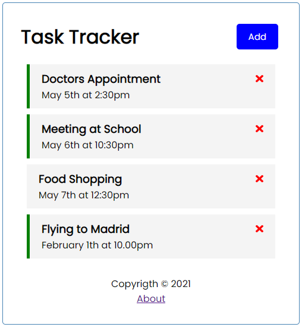
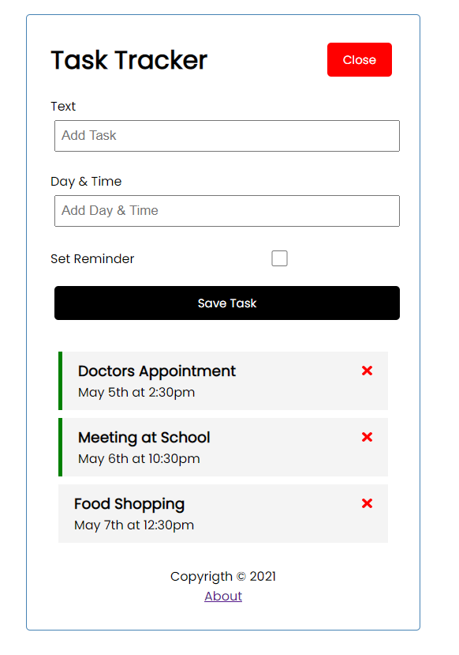

# TaskTracker

This project was generated with [Angular CLI](https://github.com/angular/angular-cli) version 11.2.7.

## Project Usage

Download the project files, then in the same directory install the dependencies with `npm install` or `yarn add`.
Run `ng serve` for a dev server. Navigate to `http://localhost:4200/`. The app will automatically reload if you change any of the source files.
Run `npm run server` to run json-server to simulate a fake backend. Navigate to `http://localhost:5000/`.

## Project Overview

***********************************************************************************************

&nbsp;&nbsp;&nbsp;&nbsp;&nbsp;&nbsp; 

***********************************************************************************************

